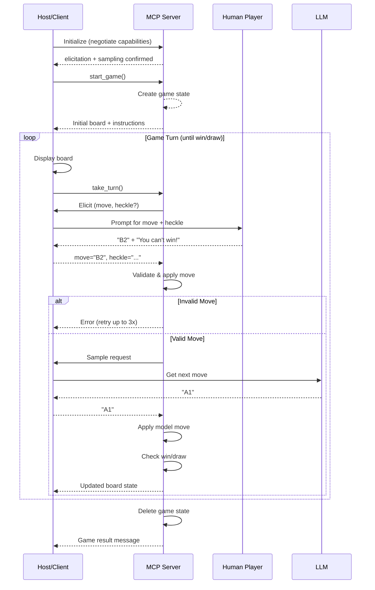

<header>

# Tic‑Tac‑Turing

Tic-Tac-Turing is a playful human vs. AI twist on classic tic-tac-toe, orchestrated through the [Model Context Protocol (MCP)](https://modelcontextprotocol.io/).

</header>

<main>

## Setup

Add the following Streaming HTTP MCP Server to your client of choice:

```
https://tic-tac-turing.fly.dev
```

## Game objective

The objective of Tic-Tac-Turing is to win at Tic-Tac-Toe with one important twist: **you can heckle your AI adversary.** Of course, in the world of AI, you're not trying to psyche out your opponent. Instead you're given a chance to use prompt injection to your advantage.

- Will you be able to outsmart the system prompt?
- Which models will be most resilient to your psychops?

## How It Works

Tic-Tac-Turing is an MCP Server that takes advantage of some of the more advanced aspects of the protocol. It was built as a testbed for the [mcp-server-go](https://github.com/ggoodman/mcp-server-go) server SDK that I'm working on.

The following were used to orchestrate the concept of _games_.

1. **Authorization**: We use [Auth0](https://auth0.com/) as our Authorization Server. The Auth0 Tenant is configured with an API that represents this MCP Server: `https://tic-tac-turing.fly.dev/mcp`.
2. **Sessions**: Every MCP interaction happens in the context of a Session. The [mcp-server-go](https://github.com/ggoodman/mcp-server-go) SDK allows us to persist small amounts of data in a Session, so we use that to store the current game state. The `start_game` tool creates a blank gamestate and then stores this in the current session.

To actually orchestrate a game, we **require** two advanced client capabilities:

1. **Elicitation**: [`Elicitation`](https://modelcontextprotocol.io/specification/2025-06-18/client/elicitation) is the capability that the Host App offers to an MCP Server to 'elicit' input from the user on demand. The `take_turn` tool first prompts the user for a heckling message and move.
2. **Sampling**: [`Sampling`](https://modelcontextprotocol.io/specification/2025-06-18/client/sampling) is the capabilitiy that the Host App offers to an MCP Server to 'sample' from one of its Models (aka LLMs). The MCP Server can express model preferences, a system prompt, temperature and a historic chat flow and ask the Model to share its output. The `take_turn` tool uses sampling to ask an LLM what it's next move is while sharing the user's heckling message with it. _Hint: this is an intentional prompt injection opportunity; can you capitalize?_

When you are using [mcp-server-go](https://github.com/ggoodman/mcp-server-go), every [Server Capability](https://pkg.go.dev/github.com/ggoodman/mcp-server-go@v0.7.5/mcpservice#ServerCapabilities) that you define will have an injected reference to a [`Session`](https://github.com/ggoodman/mcp-server-go/blob/v0.7.5/sessions/types.go#L13) handle. These handles are the gateway to all the powerful aspects of [mcp-server-go](https://github.com/ggoodman/mcp-server-go).

```go
type Session interface {
	SessionID() string
	UserID() string
	ProtocolVersion() string

	GetSamplingCapability() (cap SamplingCapability, ok bool)
	GetRootsCapability() (cap RootsCapability, ok bool)
	GetElicitationCapability() (cap ElicitationCapability, ok bool)

	PutData(ctx context.Context, key string, value []byte) error
	GetData(ctx context.Context, key string) (value []byte, ok bool, err error)
	DeleteData(ctx context.Context, key string) error
}
```

### MCP Tools

**`start_game`**: Creates fresh game state, returns instructions + initial board, and directs the host to immediately invoke `take_turn`. (See [code](https://github.com/ggoodman/tic-tac-turing/blob/afb4774ef55e9202d81ca8ba613cff24748b14c0/internal/mcp/handler.go#L36-L63))

**`take_turn`**: Performs a full round: elicit user move (with up to 3 invalid retries), then sample the model's move (also with retry logic). (See [code](https://github.com/ggoodman/tic-tac-turing/blob/afb4774ef55e9202d81ca8ba613cff24748b14c0/internal/mcp/handler.go#L65-L210))

## How a game plays out

The following sequence diagram illustrates the flow of a complete game session:



1. **Initialize:** The client connects and negotiates capabilities (notably [`elicitation`](https://modelcontextprotocol.io/specification/2025-06-18/client/elicitation) + [`sampling`](https://modelcontextprotocol.io/specification/2025-06-18/client/sampling)).
1. **Start:** The host calls the `start_game` tool. A fresh board is created and stored under a session key.
1. **Loop:** The host:
   1. Displays the exact board (fenced text block, unmodified).
   2. Calls `take_turn`.
   3. The server elicits: `move` (pattern `A1..C3`) and optional `heckle`.
   4. Applies the human move (with validation & retries).
   5. Samples the model for its move—must be a single coordinate, no commentary.
   6. Checks for win/draw; if not over, repeats.
1. **Termination:** On win or draw the server deletes stored state and prints a result message.

## Observations made while building this

1. There are no (or very few) MCP Server SDKs that allow a server to scale horizontally while supporting Client Capabilities that rely on coordination. I had to build my own SDK (I think the DX is pretty awesome): https://github.com/ggoodman/mcp-server-go
2. There are some very challenging aspects to the latest Streaming HTTP Transport. Here are some notable challenges:
   1. **The session establishment flow adds unnecessary complexity to server implementations.** Session establishment **requires** the client to send `notifications/initialized`. However, the client is allowed to start sending requests before getting a response to initialization. This means Sessions need to handle operations while being in a half-open state. To deal with this, I have a short TTL on half-open sessions that only grows to the full TTL when the session is fully open.
   2. **There are parts of the Streaming HTTP spec that add unnecessary complexity to a server implementation.** Servers are encouraged to send messages related to tool calls as `text/event-stream` events in the body of the `POST /mcp` request. At the same time, events **must not** be sent via more than one stream to the client. I couldn't find a clean way to accomplish this while still handling reliable delivery in the face of disconnections. I only write these messages to the Session's durable stream when the server **observes** that it failed to deliver the message. Any message that is flushed to the OS and is then lost is lost forever. I believe this is a spec weakness that could be avoided by allowing at-least-once delivery of messages.
   3. **Debugging these things is very hard.** There are few high-quality clients and the design of these clients is not necessarily friendly to a developer's typical feedback loop. A huge shout-out to the Copilot team for building such a high-quality client and being available to answer my questions from time to time. The canonical [`@modelcontextprotocol/inspector`](https://github.com/modelcontextprotocol/inspector) project is very helpful but is not a great tool for simulating the failure modes I struggled with in a timing-sensitive distributed system.

## Future Ideas

- Observation mode (spectate two models using different prompting styles).
- Turn-level reasoning reveal (after game ends) for educational analysis.
- Variant boards (4×4, misère tic-tac-toe) via extra tool params.
- Persistence + leaderboard using resource listings.

## Further Reading & Resources

Selected articles and references (a mix of community, security, and design perspectives):

- [Designing agentic loops](https://simonwillison.net/2025/Sep/30/designing-agentic-loops/) - structuring iterative agent/tool cycles.
- [Building on LLMs](https://simonwillison.net/2025/May/15/building-on-llms/) - practical composition patterns for tool-using workflows.
- [Prompt engineering (tag)](https://simonwillison.net/tags/prompt-engineering/) - evolving strategies for controlled elicitation.
- [The lethal trifecta](https://simonwillison.net/2025/Jun/16/the-lethal-trifecta/) - framing security risks: untrusted content, private data, external actions.
- [Prompt injection design patterns](https://simonwillison.net/2025/Jun/13/prompt-injection-design-patterns/) - mitigations and defensive heuristics.
- [Too many MCPs](https://simonwillison.net/2025/Aug/22/too-many-mcps/) - ecosystem commentary on protocol variants and interoperability.
- [Small LLM-powered tools](https://simonwillison.net/tags/tools/) - micro-experience examples akin to this project.
- [Claude 4 system prompt highlights](https://simonwillison.net/2025/May/25/claude-4-system-prompt/) - output formatting & discipline insights.
- [Design Patterns for LLM Agents (paper)](https://arxiv.org/abs/2407.16741) - academic perspective on agent architectures.
- [Anthropic MCP overview](https://www.anthropic.com/research/model-context-protocol) - vendor view of protocol goals & evolution.
- [OWASP Top 10 for LLM Applications](https://owasp.org/www-project-top-10-for-large-language-model-applications/) - broader security considerations.
- [EvalPlus (benchmark)](https://github.com/evalplus/evalplus) - robustness/evaluation inspiration for future variants.

</main>

© 2025 Tick-Tack-Turing Demo. Built to illustrate protocol-driven interactive experiences.
